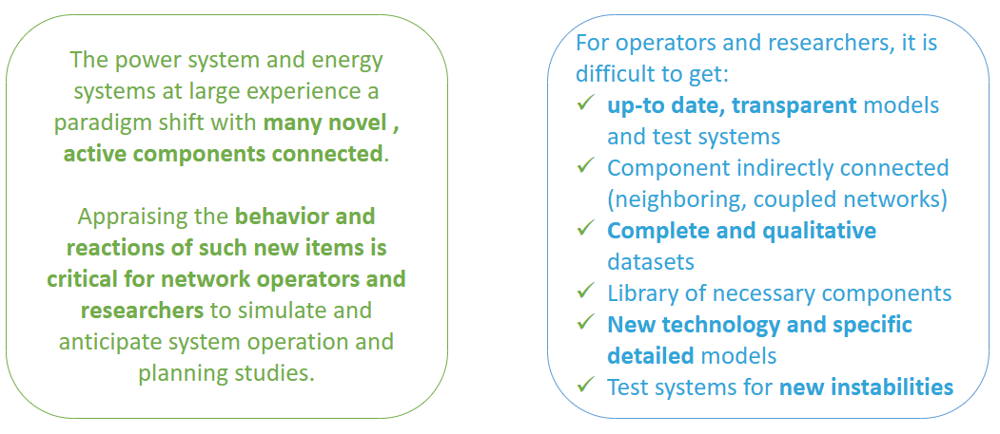
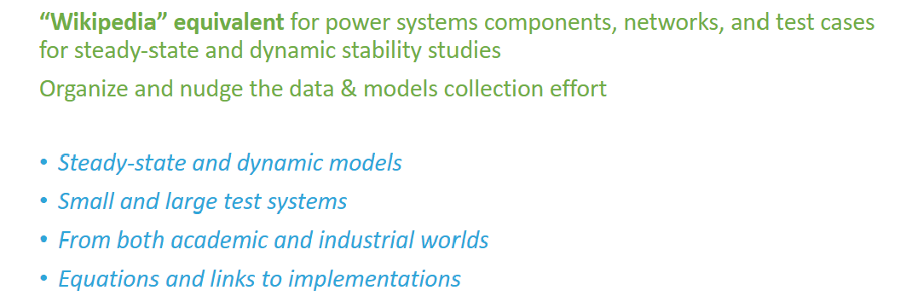

## Why this library?

{#fig-why-colib fig-alt="Reason behind Colib"}

At present, on one hand, operators manage to gather and build pragmatically a model database of the components directly connected to their network. They remain however blind or use rough proxies to cope with:
-	Components indirectly connected (e.g. to neighboring, coupled networks, such as electricity or gas grids ; and/or quite likely in a soon future: across sectors)
-	Future connected ones (components at design stage, latest technology, and proprietary manufacturer models). 

On the other hand, research also suffers from the lack of all the necessary component models and is slowed down by the effort required to circumvent it.

They both face the need for a **collaborative shared dynamic simulation library** that would benefit to all by its high **quality, transparency of model equations, and concrete applications** (real test cases).

## What is colib and what does it contain?

{#fig-what-colib fig-alt="What is Colib?"}

Each model or test case is formally described in a dedicated post (like a wikipedia webpage), with links to known existing implementations.
Some of the models and test cases directly come from CRESYM projects outputs, others are originated from external royalty-free projects. 

